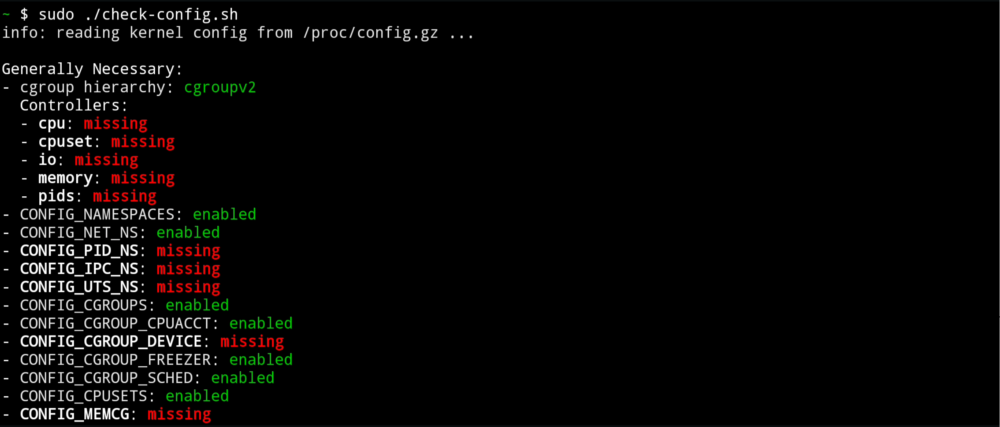
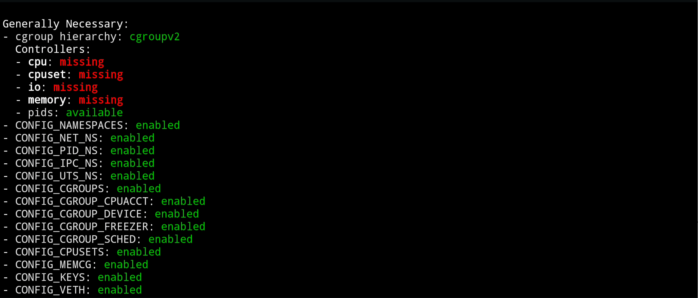

Now that you've got the lowdown on what we're going to do, its time to get
things set up!

## Requirements

- A Linux system (preferably running Ubuntu) which will serve as the build
  environment. This system should have more than 500 GB storage and more than 16
  GB RAM (preferably 64 GB).
- An Android phone (on which you will run docker). Please use an older device
  (one that you do not use for your everyday things).
- A USB cable (preferably the phone charger cable) to connect the phone to the
  system.

### Notes

- In cases like mine where I did not have 16 GB RAM, I assigned 64 GB swap space
  from the non-volatile memory. This is cheaper and much better.
- The phone should be able to run LineageOS 20 or higher. Check whether this is
  true by searching for your phone model on the LineageOS website.

## Setup

It's now time to setup the phone and the build environment to run docker on
Android! Start by finding the `Build for yourself` page for your device on the
LineageOS website. For instance,
[here](https://wiki.lineageos.org/devices/enchilada/build/) is the build page
for _enchilada_.

Follow all instructions including upto the installation of LineageOS. This is 
just to test whether a working copy of LineageOS can be built on system before
proceeding to modify the kernel.

**Note: while installing LineageOS at this time, please root the phone by
sideloading Magisk. The instructions for the same are usually present in the
`Build for yourself` page.**

## Modifying the Kernel

Modifying the kernel of your phone is actually a very simple task. In
particular, we require the phone to support some kernel features that it does
not support by default. From the last section, the kernel features present by
default in your phone are all specified in a `config` or a `defconfig` file in
the `kernel` directory at the top level of the source tree.

### Finding the Kernel Source Directory

The defconfig file used in the LineageOS build can be determined by performing a
search on the `BoardConfig.mk` or `BoardConfigCommon.mk` file in the device
tree. This Makefile can be found in `device/<your phone manufacturer>/<your
phone model>`. For instance, it is `device/oneplus/sdm845-common` for the
_enchilada_. Perform a `grep` search on this file using a similar command as the
one shown below.

```bash
$ grep kernel /path/to/BoardConfigCommon.mk
TARGET_KERNEL_SOURCE := kernel/oneplus/sdm845
```

### Configuring the Kernel

**Note: all commands in this section will be performed from the root of the
kernel source tree of the device.**

Make a copy of the config file where we can add our modifications.

```bash
cd arch/arm64/configs/
cp vendor/<your phone vendor>/<your phone model>_defconfig docker_defconfig
```

Before we edit the new config file, we will first check which configuration
options are missing. In your rooted LineageOS phone, using Termux, enter the
following commands.

```bash
pkg install wget
wget https://raw.githubusercontent.com/moby/moby/master/contrib/check-config.sh
chmod +x check-config.sh
sed -i '1s_.*_#!/data/data/com.termux/files/usr/bin/bash_' check-config.sh
sudo ./check-config.sh
```

You will now receive an output which shows the missing kernel features that we
need to enable. It looks something like this for me:



The laborious part is to copy the missing options to the config file. To speed
things up here, use software such as
[scrcpy](https://github.com/Genymobile/scrcpy) to copy the output directly to
your build environment or desktop, where you can edit it quicker with powerful
text editors such as `vim`.

Simply append the required features at the bottom of `docker_defconfig`. In the
`BoardConfigCommon.mk` file, change the `TARGET_KERNEL_CONFIG` variable to also
point to this new config file.

```make
TARGET_KERNEL_CONFIG += docker_defconfig
```

**Note: to prevent these changes from being wiped on re-running `repo sync`,
additionally commit these changes locally.**

```bash
git add arch
git commit -m "Modify kernel config for docker"
```

## Building the Modified Kernel

It is finally time to build the required kernel! From the root directory of your
codebase:

```bash
source build/envsetup.sh
breakfast <your phone model>
croot
brunch <your phone model>
```

## Installing the Modified Kernel

Go to the output directory

```bash
cout
```

and flash LineageOS to your phone again with the new `boot.img` file and the
`zip` file to be sideloaded. Do not forget to root the phone again!

## Double-Checking

Just to be sure that your phone kernel has been modified, run the modified
`check_config.sh` script as before. You should see more green than red!



Move on to the next step to finally install and run docker!
