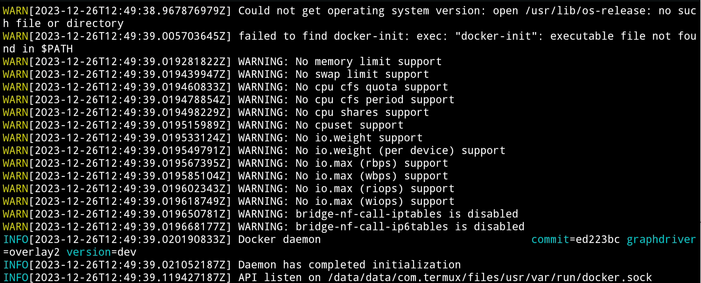
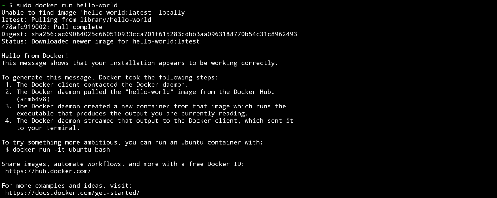

We are all set to install and run docker for the first time!

## Setup and Installation

Run the following commands in Termux to install docker and get the phone ready.

```bash
pkg in root-repo
pkg in tsu docker
mount -t tmpfs cgroup_root /sys/fs/cgroup
```

## Running

Now, run the docker Daemon `dockerd`:

```bash
sudo dockerd --iptables=false 
```

You should receive something like this:



Now for the moment of truth! In another terminal window, run docker itself

```bash
sudo docker run --rm hello-world
```
If all goes well, you should see something like this



Congratulations, you have successfully built and run docker by modifying your
phone kernel!

## What Next?

If you want to do more with docker, this
[gist](https://gist.github.com/FreddieOliveira/efe850df7ff3951cb62d74bd770dce27)
shows what else you can do with your powerful phone, now that docker is running
fine.